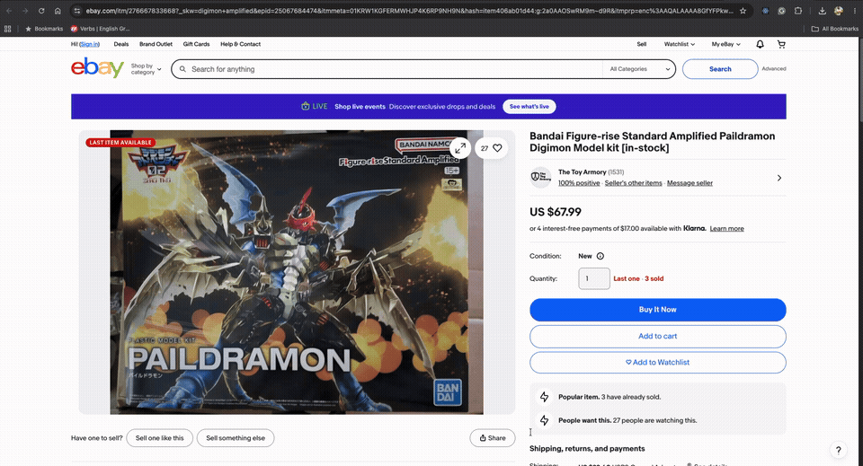

# Lab 01 URL Shortener

Module 1 Lab 01 split into:
- `lab01-url-shortener/`: Railway-ready Python backend
- `lab01-url-shortener-frontend/`: Vercel-ready static frontend

## Backend Features

- `POST /api/shorten` accepts `{"url": "https://..."}` and returns a short code
- `GET /api/links` returns recent shortened URLs
- `GET /health` returns a health response
- `GET /{short_code}` redirects to the original URL
- SQLite storage
- duplicate URLs return the existing code

## Local Development

### 1. Run the backend

```bash
cd solutions/labs/lab01-url-shortener
python3 app.py
```

The backend will run on:

```text
http://127.0.0.1:8000
```

### 2. Point the frontend at the backend

Edit:

- [../lab01-url-shortener-frontend/config.js](../lab01-url-shortener-frontend/config.js)

Use:

```js
window.APP_CONFIG = {
  API_BASE_URL: "http://127.0.0.1:8000"
};
```

### 3. Open the frontend

Open this file in your browser:

- [../lab01-url-shortener-frontend/index.html](../lab01-url-shortener-frontend/index.html)

If your browser blocks local file fetches, use a tiny local static server instead:

```bash
cd solutions/labs/lab01-url-shortener-frontend
python3 -m http.server 4173
```

Then open:

```text
http://127.0.0.1:4173
```

## Tests

```bash
cd solutions/labs/lab01-url-shortener
python3 -m unittest test_app.py
```

## Railway Deployment

### Railway backend settings

- Repository: this repo
- Root directory: leave as repo root
- Start command:

```bash
python3 solutions/labs/lab01-url-shortener/app.py
```

### Railway environment variables

Optional:

```text
CORS_ALLOW_ORIGIN=https://your-frontend.vercel.app
```

Notes:
- the backend already reads `PORT` automatically from Railway
- SQLite will work for demos, but hosted SQLite is not durable across all platform restarts

## Vercel Deployment

### Vercel frontend settings

- Import the same GitHub repo into Vercel
- Framework preset: `Other`
- Root directory:

```text
solutions/labs/lab01-url-shortener-frontend
```

### Before deploying frontend

Update:

- [../lab01-url-shortener-frontend/config.js](../lab01-url-shortener-frontend/config.js)

Set:

```js
window.APP_CONFIG = {
  API_BASE_URL: "https://your-backend.up.railway.app"
};
```

Then redeploy the frontend on Vercel.

## API Example

```bash
curl -X POST http://127.0.0.1:8000/api/shorten \
  -H "Content-Type: application/json" \
  -d '{"url":"https://example.com"}'
```

## Demo Recording

A preview that plays directly in the README:



Full-quality recording:

- [demo/lab01-demo.mov](./demo/lab01-demo.mov)
