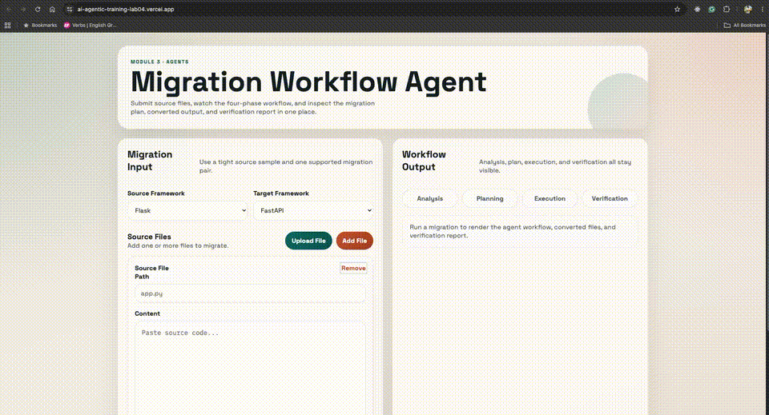

# Lab 03 Migration Workflow Agent

Module 3 Lab 03 split into:
- `lab03-migration-workflow/`: Render-ready FastAPI backend
- `lab03-migration-workflow-frontend/`: Vercel-ready static frontend

## Backend Features

- `POST /api/migrate` accepts source files plus source and target frameworks
- `GET /health` returns service metadata
- `GET /` returns service metadata and supported migration pairs
- Pydantic request and response validation
- agent state with explicit phases:
  - analysis
  - planning
  - execution
  - verification
- migration client abstraction with:
  - mock migration workflow for local development
  - OpenAI support through the OpenAI-compatible API
  - Gemini support
  - Groq support through the OpenAI-compatible API
- structured JSON response with plan, migrated files, verification, and errors

## Supported Demo Pairs

- `flask -> fastapi`
- `express -> hono`

The mock provider is strongest on those two pairs. If you want more framework combinations, extend the heuristics or switch to an LLM-backed provider.

## Local Development

### 1. Run the backend

```bash
cd solutions/labs/lab03-migration-workflow
python3 -m venv .venv
source .venv/bin/activate
pip install -r requirements.txt
uvicorn main:app --reload
```

The backend will run on:

```text
http://127.0.0.1:8000
```

Optional environment variables:

```text
MIGRATION_PROVIDER=mock
OPENAI_API_KEY=your-openai-key
OPENAI_MODEL=gpt-4.1-mini
GEMINI_API_KEY=your-gemini-key
GEMINI_MODEL=gemini-2.5-flash
GROQ_API_KEY=your-groq-key
GROQ_MODEL=llama-3.1-8b-instant
CORS_ALLOW_ORIGINS=http://127.0.0.1:4173,https://your-frontend.vercel.app
```

Provider notes:
- `MIGRATION_PROVIDER=mock` uses the built-in migration heuristics
- `MIGRATION_PROVIDER=openai` uses `OPENAI_API_KEY`
- `MIGRATION_PROVIDER=gemini` uses `GEMINI_API_KEY` or `GOOGLE_API_KEY`
- `MIGRATION_PROVIDER=groq` uses `GROQ_API_KEY`

### Local `.env` option

You can keep secrets out of your shell history by creating a local file at:

```text
solutions/labs/lab03-migration-workflow/.env
```

Example:

```text
MIGRATION_PROVIDER=openai
OPENAI_API_KEY=your-openai-key
OPENAI_MODEL=gpt-4.1-mini
CORS_ALLOW_ORIGINS=http://127.0.0.1:4173
```

### 2. Point the frontend at the backend

Edit:

- [../lab03-migration-workflow-frontend/config.js](../lab03-migration-workflow-frontend/config.js)

Use:

```js
window.APP_CONFIG = {
  API_BASE_URL: "http://127.0.0.1:8000"
};
```

### 3. Open the frontend

Open this file in your browser:

- [../lab03-migration-workflow-frontend/index.html](../lab03-migration-workflow-frontend/index.html)

If your browser blocks local file fetches, use a tiny local static server instead:

```bash
cd solutions/labs/lab03-migration-workflow-frontend
python3 -m http.server 4173
```

Then open:

```text
http://127.0.0.1:4173
```

## Tests

```bash
cd solutions/labs/lab03-migration-workflow
python3 -m unittest test_main.py
```

## Render Deployment

### Render backend settings

- Repository: this repo
- Root directory:

```text
solutions/labs/lab03-migration-workflow
```

- Build command:

```bash
pip install -r requirements.txt
```

- Start command:

```bash
uvicorn main:app --host 0.0.0.0 --port $PORT
```

## Vercel Deployment

### Vercel frontend settings

- Import the same GitHub repo into Vercel
- Framework preset: `Other`
- Root directory:

```text
solutions/labs/lab03-migration-workflow-frontend
```

### Before deploying frontend

Update:

- [../lab03-migration-workflow-frontend/config.js](../lab03-migration-workflow-frontend/config.js)

Set:

```js
window.APP_CONFIG = {
  API_BASE_URL: "https://your-backend.onrender.com"
};
```

Then redeploy the frontend on Vercel.

## Example Request

```bash
curl -X POST http://127.0.0.1:8000/api/migrate \
  -H "Content-Type: application/json" \
  -d '{
    "source_framework": "flask",
    "target_framework": "fastapi",
    "source_files": [
      {
        "path": "app.py",
        "content": "from flask import Flask, jsonify\n\napp = Flask(__name__)\n\n@app.route(\"/hello\")\ndef hello():\n    return jsonify({\"message\": \"hello\"})\n"
      }
    ]
  }'
```

## Demo Recording

A preview that plays directly in the README:



Full-quality recording:

- [demo/lab03-demo.mov](./demo/lab03-demo.mov)
